# Lineage

Evolution history of the SVG generator. Each entry records a generation,
what mutation was applied, and how fitness changed.

---

### EXTINCTION Generation 136
**Mutation:** extinction | **Fitness:** 81.08 (+4.27) | EXTINCTION EVENT: Applied mutation (triple mutation, 8 variants)

### Generation 135
**Mutation:** additive | **Fitness:** 81.34 (+0.10) | Added duplicated shape elements

### EXTINCTION Generation 134
**Mutation:** extinction | **Fitness:** 85.79 (+5.72) | EXTINCTION EVENT: Applied mutation (triple mutation, 8 variants)

### Generation 133
**Mutation:** numeric_drift | **Fitness:** 84.64 (+1.64) | Adjusted numeric parameters

### EXTINCTION Generation 132
**Mutation:** extinction | **Fitness:** 87.51 (+11.86) | EXTINCTION EVENT: Applied mutation (triple mutation, 8 variants)

### Generation 131
**Mutation:** numeric_drift | **Fitness:** 80.11 (+1.16) | Adjusted numeric parameters

### EXTINCTION Generation 130
**Mutation:** extinction | **Fitness:** 83.72 (+6.15) | EXTINCTION EVENT: Applied mutation (triple mutation, 8 variants)

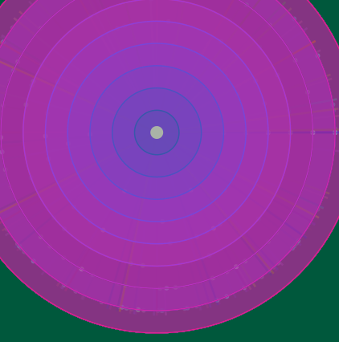

### EXTINCTION Generation 129
**Mutation:** extinction | **Fitness:** 82.33 (+2.56) | EXTINCTION EVENT: Applied mutation (triple mutation, 8 variants)

### Generation 128
**Mutation:** structural_swap | **Fitness:** 84.52 (+1.16) | Swapped shape drawing blocks

### EXTINCTION Generation 127
**Mutation:** extinction | **Fitness:** 87.84 (+4.47) | EXTINCTION EVENT: Applied mutation (triple mutation, 8 variants)

### EXTINCTION Generation 126
**Mutation:** extinction | **Fitness:** 88.14 (+10.16) | EXTINCTION EVENT: Applied mutation (triple mutation, 8 variants)

### Generation 125
**Mutation:** color_shift | **Fitness:** 82.64 (+0.60) | Shifted color palette

### EXTINCTION Generation 124
**Mutation:** extinction | **Fitness:** 86.85 (+7.59) | EXTINCTION EVENT: Applied mutation (triple mutation, 8 variants)

### Generation 123
**Mutation:** additive | **Fitness:** 84.08 (+0.19) | Added duplicated shape elements

### EXTINCTION Generation 122
**Mutation:** extinction | **Fitness:** 88.69 (+11.78) | EXTINCTION EVENT: Applied mutation (triple mutation, 8 variants)

### Generation 121
**Mutation:** color_shift | **Fitness:** 81.67 (+0.35) | Shifted color palette

### EXTINCTION Generation 120
**Mutation:** extinction | **Fitness:** 86.06 (+6.62) | EXTINCTION EVENT: Applied mutation (triple mutation, 8 variants)

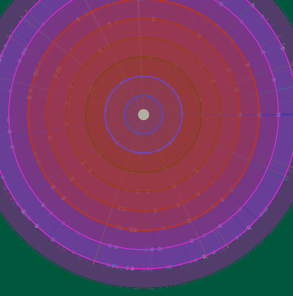

### EXTINCTION Generation 119
**Mutation:** extinction | **Fitness:** 84.18 (+5.87) | EXTINCTION EVENT: Applied mutation (triple mutation, 8 variants)

### Generation 118
**Mutation:** additive | **Fitness:** 82.81 (+0.23) | Added duplicated shape elements

### EXTINCTION Generation 117
**Mutation:** extinction | **Fitness:** 87.08 (+6.50) | EXTINCTION EVENT: Applied mutation (triple mutation, 8 variants)

### EXTINCTION Generation 116
**Mutation:** extinction | **Fitness:** 85.03 (+6.96) | EXTINCTION EVENT: Applied mutation (triple mutation, 8 variants)

### Generation 115
**Mutation:** numeric_drift | **Fitness:** 82.63 (+0.04) | Adjusted numeric parameters

### EXTINCTION Generation 114
**Mutation:** extinction | **Fitness:** 87.16 (+6.01) | EXTINCTION EVENT: Applied mutation (triple mutation, 8 variants)

### Generation 113
**Mutation:** structural_swap | **Fitness:** 85.60 (+3.11) | Swapped shape drawing blocks

### EXTINCTION Generation 112
**Mutation:** extinction | **Fitness:** 87.01 (+8.36) | EXTINCTION EVENT: Applied mutation (triple mutation, 8 variants)

### Generation 111
**Mutation:** color_shift | **Fitness:** 82.97 (+0.71) | Shifted color palette

### EXTINCTION Generation 110
**Mutation:** extinction | **Fitness:** 86.68 (+5.40) | EXTINCTION EVENT: Applied mutation (triple mutation, 8 variants)

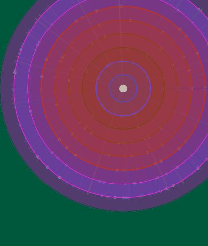

### EXTINCTION Generation 109
**Mutation:** extinction | **Fitness:** 85.70 (+5.57) | EXTINCTION EVENT: Applied mutation (triple mutation, 8 variants)

### EXTINCTION Generation 108
**Mutation:** extinction | **Fitness:** 84.58 (+4.88) | EXTINCTION EVENT: Applied mutation (triple mutation, 8 variants)

### EXTINCTION Generation 107
**Mutation:** extinction | **Fitness:** 84.15 (+4.50) | EXTINCTION EVENT: Applied mutation (triple mutation, 8 variants)

### EXTINCTION Generation 106
**Mutation:** extinction | **Fitness:** 84.15 (+4.52) | EXTINCTION EVENT: Applied mutation (triple mutation, 8 variants)

### EXTINCTION Generation 105
**Mutation:** extinction | **Fitness:** 84.49 (+3.94) | EXTINCTION EVENT: Applied mutation (triple mutation, 8 variants)

### EXTINCTION Generation 104
**Mutation:** extinction | **Fitness:** 85.42 (+6.30) | EXTINCTION EVENT: Applied mutation (triple mutation, 8 variants)

### Generation 103
**Mutation:** structural_swap | **Fitness:** 83.64 (+2.21) | Swapped shape drawing blocks

### EXTINCTION Generation 102
**Mutation:** extinction | **Fitness:** 85.98 (+5.78) | EXTINCTION EVENT: Applied mutation (triple mutation, 8 variants)

### EXTINCTION Generation 101
**Mutation:** extinction | **Fitness:** 84.65 (+4.44) | EXTINCTION EVENT: Applied mutation (triple mutation, 8 variants)

### Generation 100
**Mutation:** color_shift | **Fitness:** 84.68 (+3.51) | Shifted color palette

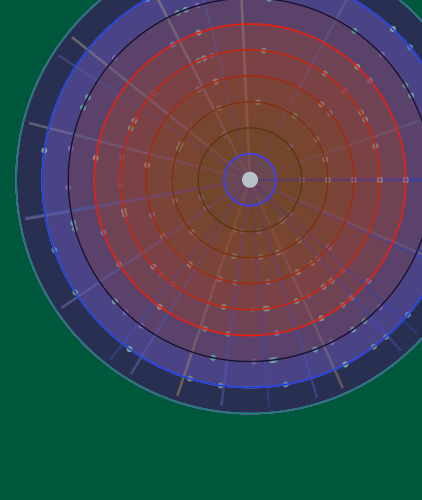

### EXTINCTION Generation 99
**Mutation:** extinction | **Fitness:** 85.71 (+6.87) | EXTINCTION EVENT: Applied mutation (triple mutation, 8 variants)

### EXTINCTION Generation 98
**Mutation:** extinction | **Fitness:** 83.49 (+3.41) | EXTINCTION EVENT: Applied mutation (triple mutation, 8 variants)

### EXTINCTION Generation 97
**Mutation:** extinction | **Fitness:** 84.24 (+4.90) | EXTINCTION EVENT: Applied mutation (triple mutation, 8 variants)

### EXTINCTION Generation 96
**Mutation:** extinction | **Fitness:** 83.84 (+4.26) | EXTINCTION EVENT: Applied mutation (triple mutation, 8 variants)

### EXTINCTION Generation 95
**Mutation:** extinction | **Fitness:** 84.25 (+3.89) | EXTINCTION EVENT: Applied mutation (triple mutation, 8 variants)

### EXTINCTION Generation 94
**Mutation:** extinction | **Fitness:** 84.61 (+5.20) | EXTINCTION EVENT: Applied mutation (triple mutation, 8 variants)

### EXTINCTION Generation 93
**Mutation:** extinction | **Fitness:** 83.90 (+3.81) | EXTINCTION EVENT: Applied mutation (triple mutation, 8 variants)

### EXTINCTION Generation 92
**Mutation:** extinction | **Fitness:** 84.47 (+4.54) | EXTINCTION EVENT: Applied mutation (triple mutation, 8 variants)

### EXTINCTION Generation 91
**Mutation:** extinction | **Fitness:** 84.50 (+6.37) | EXTINCTION EVENT: Applied mutation (triple mutation, 8 variants)

### Generation 90
**Mutation:** additive | **Fitness:** 82.71 (+0.37) | Added duplicated shape elements

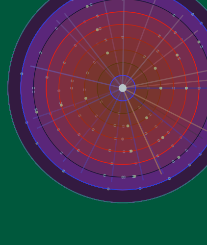

### EXTINCTION Generation 89
**Mutation:** extinction | **Fitness:** 86.90 (+5.81) | EXTINCTION EVENT: Applied mutation (triple mutation, 8 variants)

### EXTINCTION Generation 88
**Mutation:** extinction | **Fitness:** 85.85 (+3.69) | EXTINCTION EVENT: Applied mutation (triple mutation, 8 variants)

### EXTINCTION Generation 87
**Mutation:** extinction | **Fitness:** 86.85 (+5.60) | EXTINCTION EVENT: Applied mutation (triple mutation, 8 variants)

### EXTINCTION Generation 86
**Mutation:** extinction | **Fitness:** 86.06 (+7.59) | EXTINCTION EVENT: Applied mutation (triple mutation, 8 variants)

### Generation 85
**Mutation:** numeric_drift | **Fitness:** 83.15 (+0.64) | Adjusted numeric parameters

### EXTINCTION Generation 84
**Mutation:** extinction | **Fitness:** 87.05 (+6.76) | EXTINCTION EVENT: Applied mutation (triple mutation, 8 variants)

### EXTINCTION Generation 83
**Mutation:** extinction | **Fitness:** 84.87 (+6.12) | EXTINCTION EVENT: Applied mutation (triple mutation, 8 variants)

### Generation 82
**Mutation:** color_shift | **Fitness:** 83.28 (+0.28) | Shifted color palette

### EXTINCTION Generation 81
**Mutation:** extinction | **Fitness:** 87.52 (+9.23) | EXTINCTION EVENT: Applied mutation (triple mutation, 8 variants)

### Generation 80
**Mutation:** numeric_drift | **Fitness:** 83.03 (+1.66) | Adjusted numeric parameters

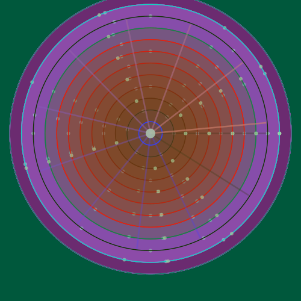

### EXTINCTION Generation 79
**Mutation:** extinction | **Fitness:** 86.23 (+5.08) | EXTINCTION EVENT: Applied mutation (triple mutation, 8 variants)

### EXTINCTION Generation 78
**Mutation:** extinction | **Fitness:** 85.98 (+3.62) | EXTINCTION EVENT: Applied mutation (triple mutation, 8 variants)

### EXTINCTION Generation 77
**Mutation:** extinction | **Fitness:** 87.17 (+4.14) | EXTINCTION EVENT: Applied mutation (triple mutation, 8 variants)

### EXTINCTION Generation 76
**Mutation:** extinction | **Fitness:** 87.84 (+8.17) | EXTINCTION EVENT: Applied mutation (triple mutation, 8 variants)

### Generation 75
**Mutation:** color_shift | **Fitness:** 84.40 (+0.44) | Shifted color palette

### EXTINCTION Generation 74
**Mutation:** extinction | **Fitness:** 88.70 (+6.85) | EXTINCTION EVENT: Applied mutation (triple mutation, 8 variants)

### EXTINCTION Generation 73
**Mutation:** extinction | **Fitness:** 86.24 (+8.91) | EXTINCTION EVENT: Applied mutation (triple mutation, 8 variants)

### EXTINCTION Generation 72
**Mutation:** extinction | **Fitness:** 82.15 (+4.22) | EXTINCTION EVENT: Applied mutation (triple mutation, 8 variants)

### EXTINCTION Generation 71
**Mutation:** extinction | **Fitness:** 82.71 (+3.97) | EXTINCTION EVENT: Applied mutation (triple mutation, 8 variants)

### Generation 70
**Mutation:** structural_swap | **Fitness:** 83.44 (+1.90) | Swapped shape drawing blocks

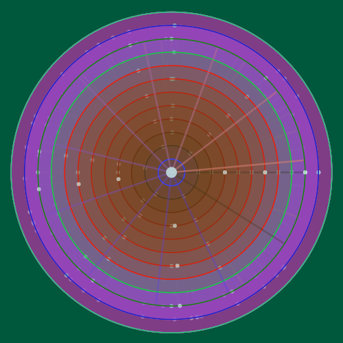

### Generation 69
**Mutation:** numeric_drift | **Fitness:** 86.24 (+2.29) | Adjusted numeric parameters

### EXTINCTION Generation 68
**Mutation:** extinction | **Fitness:** 88.66 (+5.55) | EXTINCTION EVENT: Applied mutation (triple mutation, 8 variants)

### EXTINCTION Generation 67
**Mutation:** extinction | **Fitness:** 88.04 (+4.17) | EXTINCTION EVENT: Applied mutation (triple mutation, 8 variants)

### EXTINCTION Generation 66
**Mutation:** extinction | **Fitness:** 88.80 (+10.03) | EXTINCTION EVENT: Applied mutation (triple mutation, 8 variants)

### Generation 65
**Mutation:** color_shift | **Fitness:** 83.71 (+1.27) | Shifted color palette

### EXTINCTION Generation 64
**Mutation:** extinction | **Fitness:** 87.39 (+4.99) | EXTINCTION EVENT: Applied mutation (triple mutation, 8 variants)

### EXTINCTION Generation 63
**Mutation:** extinction | **Fitness:** 87.36 (+6.52) | EXTINCTION EVENT: Applied mutation (triple mutation, 8 variants)

### Generation 62
**Mutation:** color_shift | **Fitness:** 85.79 (+1.44) | Shifted color palette

### EXTINCTION Generation 61
**Mutation:** extinction | **Fitness:** 89.22 (+12.90) | EXTINCTION EVENT: Applied mutation (triple mutation, 8 variants)

### Generation 60
**Mutation:** numeric_drift | **Fitness:** 81.27 (+0.36) | Adjusted numeric parameters

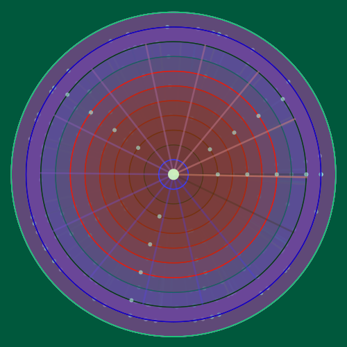

### EXTINCTION Generation 59
**Mutation:** extinction | **Fitness:** 85.86 (+4.04) | EXTINCTION EVENT: Applied mutation (triple mutation, 8 variants)

### Generation 58
**Mutation:** color_shift | **Fitness:** 86.79 (+3.32) | Shifted color palette

### EXTINCTION Generation 57
**Mutation:** extinction | **Fitness:** 88.43 (+7.95) | EXTINCTION EVENT: Applied mutation (triple mutation, 8 variants)

### EXTINCTION Generation 56
**Mutation:** extinction | **Fitness:** 85.26 (+4.84) | EXTINCTION EVENT: Applied mutation (triple mutation, 8 variants)

### Generation 55
**Mutation:** numeric_drift | **Fitness:** 85.17 (+0.90) | Adjusted numeric parameters

### EXTINCTION Generation 54
**Mutation:** extinction | **Fitness:** 89.19 (+8.80) | EXTINCTION EVENT: Applied mutation (triple mutation, 8 variants)

### Generation 53
**Mutation:** color_shift | **Fitness:** 85.11 (+4.34) | Shifted color palette

### Generation 52
**Mutation:** numeric_drift | **Fitness:** 85.41 (+1.13) | Adjusted numeric parameters

### EXTINCTION Generation 51
**Mutation:** extinction | **Fitness:** 89.05 (+9.92) | EXTINCTION EVENT: Applied mutation (triple mutation, 8 variants)

### Generation 50
**Mutation:** numeric_drift | **Fitness:** 83.93 (+0.75) | Adjusted numeric parameters

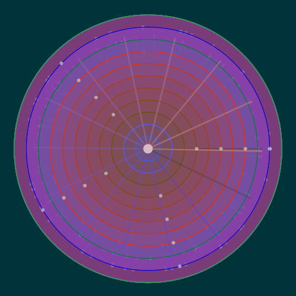

### EXTINCTION Generation 49
**Mutation:** extinction | **Fitness:** 87.83 (+6.41) | EXTINCTION EVENT: Applied mutation (triple mutation, 8 variants)

### EXTINCTION Generation 48
**Mutation:** extinction | **Fitness:** 86.10 (+5.63) | EXTINCTION EVENT: Applied mutation (triple mutation, 8 variants)

### EXTINCTION Generation 47
**Mutation:** extinction | **Fitness:** 84.30 (+4.60) | EXTINCTION EVENT: Applied mutation (triple mutation, 8 variants)

### Generation 46
**Mutation:** structural_swap | **Fitness:** 83.96 (+7.30) | Swapped shape drawing blocks

### Generation 45
**Mutation:** additive | **Fitness:** 81.48 (+0.53) | Added duplicated shape elements

### EXTINCTION Generation 44
**Mutation:** extinction | **Fitness:** 85.76 (+8.43) | EXTINCTION EVENT: Applied mutation (triple mutation, 8 variants)

### Generation 43
**Mutation:** additive | **Fitness:** 82.17 (+0.40) | Added duplicated shape elements

### EXTINCTION Generation 42
**Mutation:** extinction | **Fitness:** 86.35 (+3.75) | EXTINCTION EVENT: Applied mutation (triple mutation, 8 variants)

### EXTINCTION Generation 41
**Mutation:** extinction | **Fitness:** 87.10 (+8.77) | EXTINCTION EVENT: Applied mutation (triple mutation, 8 variants)

### Generation 40
**Mutation:** additive | **Fitness:** 82.92 (+0.56) | Added duplicated shape elements

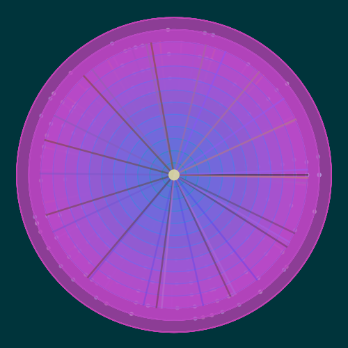

### EXTINCTION Generation 39
**Mutation:** extinction | **Fitness:** 87.09 (+5.82) | EXTINCTION EVENT: Applied mutation (triple mutation, 8 variants)

### Generation 38
**Mutation:** structural_swap | **Fitness:** 85.79 (+3.31) | Swapped shape drawing blocks

### EXTINCTION Generation 37
**Mutation:** extinction | **Fitness:** 87.03 (+12.37) | EXTINCTION EVENT: Applied mutation (triple mutation, 8 variants)

### Generation 36
**Mutation:** additive | **Fitness:** 79.24 (+2.88) | Added duplicated shape elements

### Generation 35
**Mutation:** additive | **Fitness:** 81.21 (+0.22) | Added duplicated shape elements

### EXTINCTION Generation 34
**Mutation:** extinction | **Fitness:** 85.83 (+7.07) | EXTINCTION EVENT: Applied mutation (triple mutation, 8 variants)

### Generation 33
**Mutation:** structural_swap | **Fitness:** 83.35 (+0.73) | Swapped shape drawing blocks

### Generation 32
**Mutation:** numeric_drift | **Fitness:** 87.30 (+4.80) | Adjusted numeric parameters

### EXTINCTION Generation 31
**Mutation:** extinction | **Fitness:** 87.39 (+8.41) | EXTINCTION EVENT: Applied mutation (triple mutation, 8 variants)

### Generation 30
**Mutation:** additive | **Fitness:** 83.81 (+0.69) | Added duplicated shape elements

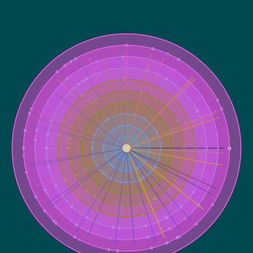

### EXTINCTION Generation 29
**Mutation:** extinction | **Fitness:** 87.96 (+7.81) | EXTINCTION EVENT: Applied mutation (triple mutation, 8 variants)

### Generation 28
**Mutation:** structural_swap | **Fitness:** 84.90 (+1.27) | Swapped shape drawing blocks

### EXTINCTION Generation 27
**Mutation:** extinction | **Fitness:** 88.35 (+13.95) | EXTINCTION EVENT: Applied mutation (triple mutation, 8 variants)

### Generation 26
**Mutation:** numeric_drift | **Fitness:** 79.01 (+0.33) | Adjusted numeric parameters

### Generation 25
**Mutation:** additive | **Fitness:** 83.34 (+0.93) | Added duplicated shape elements

### EXTINCTION Generation 24
**Mutation:** extinction | **Fitness:** 87.00 (+10.19) | EXTINCTION EVENT: Applied mutation (triple mutation, 8 variants)

### Generation 23
**Mutation:** color_shift | **Fitness:** 81.05 (+0.93) | Shifted color palette

### EXTINCTION Generation 22
**Mutation:** extinction | **Fitness:** 84.98 (+4.88) | EXTINCTION EVENT: Applied mutation (triple mutation, 8 variants)

### EXTINCTION Generation 21
**Mutation:** extinction | **Fitness:** 84.96 (+8.05) | EXTINCTION EVENT: Applied mutation (triple mutation, 8 variants)

### Generation 20
**Mutation:** color_shift | **Fitness:** 80.99 (+1.03) | Shifted color palette

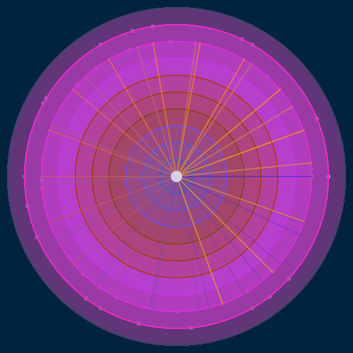

### EXTINCTION Generation 19
**Mutation:** extinction | **Fitness:** 84.74 (+7.18) | EXTINCTION EVENT: Applied mutation (triple mutation, 8 variants)

### Generation 18
**Mutation:** additive | **Fitness:** 82.40 (+0.88) | Added duplicated shape elements

### Generation 17
**Mutation:** structural_swap | **Fitness:** 86.36 (+9.96) | Swapped shape drawing blocks

### Generation 16
**Mutation:** color_shift | **Fitness:** 80.93 (+2.88) | Shifted color palette

### Generation 15
**Mutation:** additive | **Fitness:** 82.43 (+2.96) | Added duplicated shape elements

### Generation 14
**Mutation:** additive | **Fitness:** 83.77 (+6.11) | Added duplicated shape elements

### Generation 13
**Mutation:** color_shift | **Fitness:** 82.18 (+2.51) | Shifted color palette

### Generation 12
**Mutation:** additive | **Fitness:** 84.14 (+1.19) | Added duplicated shape elements

### EXTINCTION Generation 11
**Mutation:** extinction | **Fitness:** 87.40 (+11.75) | EXTINCTION EVENT: Applied mutation (triple mutation, 8 variants)

### Generation 10
**Mutation:** additive | **Fitness:** 79.88 (+2.36) | Added duplicated shape elements

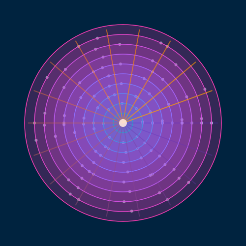

### Generation 9
**Mutation:** numeric_drift | **Fitness:** 81.59 (+8.47) | Adjusted numeric parameters

### Generation 8
**Mutation:** additive | **Fitness:** 76.46 (+1.58) | Added duplicated shape elements

### Generation 7
**Mutation:** numeric_drift | **Fitness:** 78.06 (+9.13) | Adjusted numeric parameters

### Generation 6
**Mutation:** additive | **Fitness:** 72.16 (+4.96) | Added duplicated shape elements

### Generation 5
**Mutation:** structural_swap | **Fitness:** 69.45 (+0.00) | Swapped shape drawing blocks

### Generation 4
**Mutation:** structural_swap | **Fitness:** 73.20 (+11.51) | Swapped shape drawing blocks

### Generation 3
**Mutation:** color_shift | **Fitness:** 63.44 (+3.73) | Shifted color palette

### Generation 2
**Mutation:** color_shift | **Fitness:** 61.23 (+3.05) | Shifted color palette

### Generation 1
**Mutation:** color_shift | **Fitness:** 83.18 (+0.00) | Shifted color palette

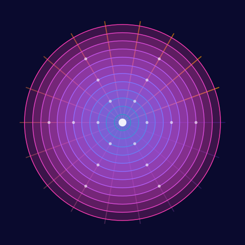
