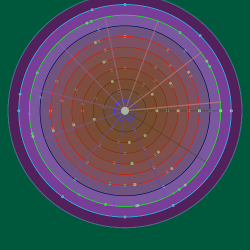

# evolveSVG

A self-evolving repository. The code in this repo mutates itself on a schedule,
generating new SVG artwork through genetic programming. No human writes code after
the initial commit. The git history is a fossil record of artificial evolution.

 

## Current Output



## Fitness Over Time


## Mutation Genome

Each character represents one generation's mutation type:
`N`=numeric drift, `S`=structural swap, `C`=color shift, `A`=additive, `E`=extinction event

```
CCCS.ANANAEACAA
```

## How It Works

1. A GitHub Actions cron job runs 10 times per day
2. The `mutator` parses `generator.py` using Python's `ast` module and applies random mutations
3. Four mutant variants are generated and executed
4. Each variant's SVG output is scored on complexity, spatial distribution, color diversity, and novelty
5. The highest-scoring variant becomes the new `generator.py`
6. Losers are archived in the `graveyard/`
7. If fitness plateaus for 10 generations, an extinction event triggers triple mutations with 8 variants

Zero external dependencies. Pure Python stdlib. No API calls. The only input is the repo's own past.

## Links

- [Lineage](LINEAGE.md) — full evolution history with visual snapshots
- [Hall of Fame](output/hall_of_fame/) — top 5 all-time generators
- [Evolution Animation](output/evolution.html) — animated playback (clone and open locally)
- [Graveyard](graveyard/) — every losing variant, preserved for the record